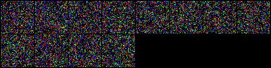
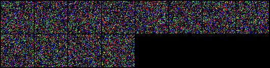

# Denoising diffusion models

- in this repo I will implement a denoising diffusion model from the [paper](paper/2006.11239.pdf)

## Early Results

---
### Noise sampling process

## Helpful resources

- https://github.com/lucidrains/denoising-diffusion-pytorch
- https://github.com/hojonathanho/diffusion
- https://www.youtube.com/watch?v=TBCRlnwJtZU
