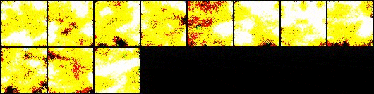

# Denoising diffusion models

- Implementation of a denoising diffusion model from the [paper](paper/2006.11239.pdf)

## Early Results

---

---
## Dataset used
- [Landscapes dataset](https://www.kaggle.com/datasets/arnaud58/landscape-pictures)

## Helpful resources

- https://github.com/lucidrains/denoising-diffusion-pytorch
- https://github.com/hojonathanho/diffusion
- https://www.youtube.com/watch?v=TBCRlnwJtZU
