# PyTorch Implementation of Denoising Diffusion Probabilistic Models

## Papers implemented

- [Denoising Diffusion Probabilistic Models](https://arxiv.org/abs/2006.11239)
- [CLASSIFIER-FREE DIFFUSION GUIDANCE](https://arxiv.org/abs/2207.12598)

## Results

---
## Unconditional Diffusion Model

### Sample images

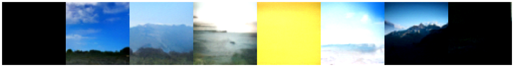
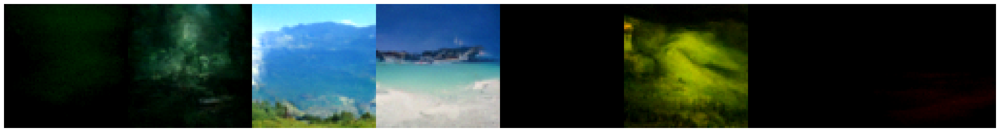
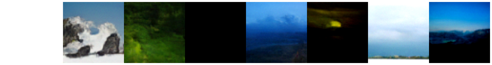

#### Here's a gif I made from the last 20 training epochs :)

---
## Conditional Diffusion model

### Sample images
##### All of them are frogs 🐸(*it's one of the labels in the CIFAR10 dataset*), because why not :), although maybe a horse could have been a nice choice too.

### This time we have done things 4 ways, since we have CFG(Classifier free guidance) and EMA(Exponential Moving Average)

### 🚫EMA 🚫CFG

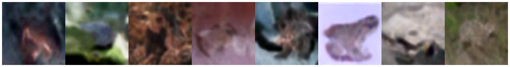
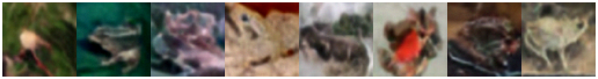

### 🚫EMA ✅CFG
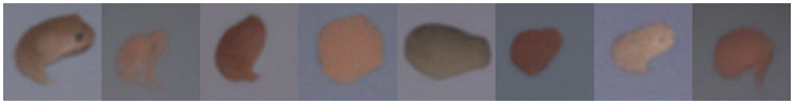
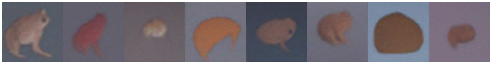

### ✅EMA 🚫CFG
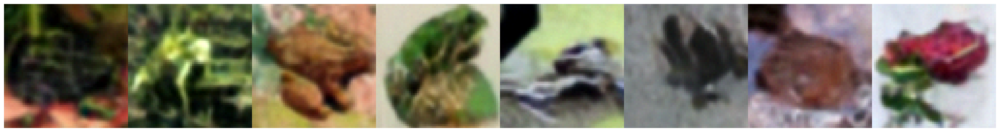
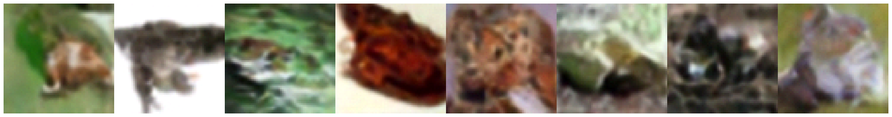

### ✅EMA ✅CFG
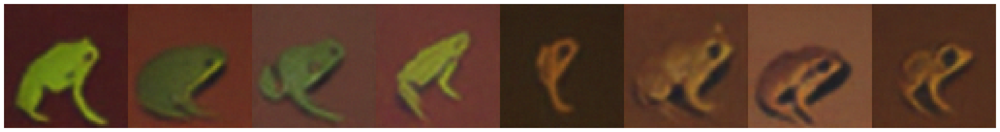
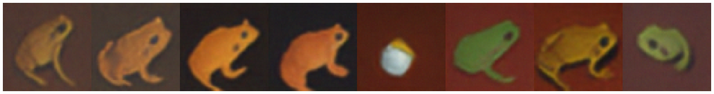

##### Note: In the CFG paper the authors mentioned heavy saturation when CFG levels were too high(i.e = 3), we are able to reproduce that same effect in the above picture. 

## Clearly the results with EMA are much better generally, however CFG helps with more stable looking images :)

---
## Dataset used
- [Landscapes dataset](https://www.kaggle.com/datasets/arnaud58/landscape-pictures) 
(for unconditional model)
- [CIFAR-10 Resized](https://www.kaggle.com/datasets/joaopauloschuler/cifar10-64x64-resized-via-cai-super-resolution)
  (for conditional model)
## Helpful resources

- https://github.com/lucidrains/denoising-diffusion-pytorch
- https://github.com/hojonathanho/diffusion
- https://www.youtube.com/watch?v=TBCRlnwJtZU
- https://theaisummer.com/unet-architectures/
