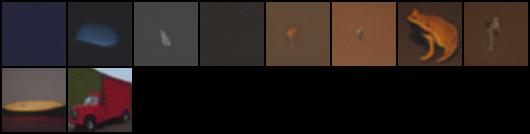

# PyTorch Implementation of Denoising Diffusion Probabilistic Models

## Papers implemented

- [Denoising Diffusion Probabilistic Models](https://arxiv.org/abs/2006.11239)

## Results

---
### Unconditional Diffusion Model

#### Some sample images

#### Here's a gif I made from the last 20 training epochs :)

---
### Conditional Diffusion model

#### Some early results

NO EMA, YES CFG  

YES EMA, YES CFG  

---
## Dataset used
- [Landscapes dataset](https://www.kaggle.com/datasets/arnaud58/landscape-pictures) 
(for unconditional model)
- [CIFAR-10 Resized](https://www.kaggle.com/datasets/joaopauloschuler/cifar10-64x64-resized-via-cai-super-resolution)
  (for conditional model)
## Helpful resources

- https://github.com/lucidrains/denoising-diffusion-pytorch
- https://github.com/hojonathanho/diffusion
- https://www.youtube.com/watch?v=TBCRlnwJtZU
